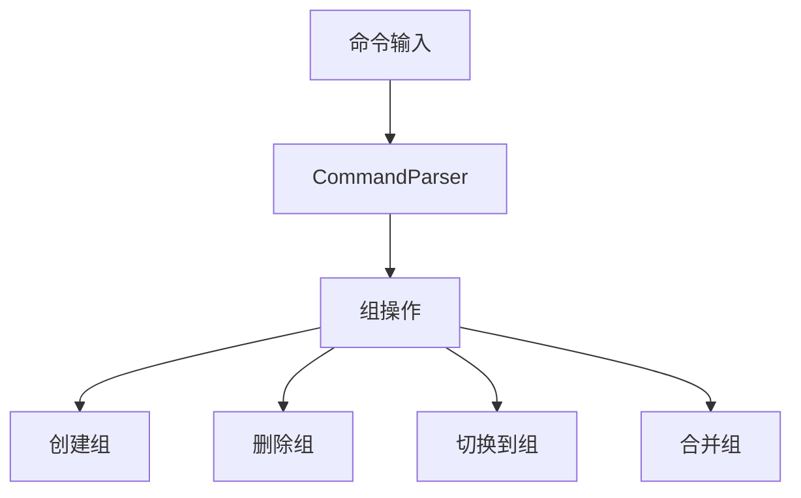
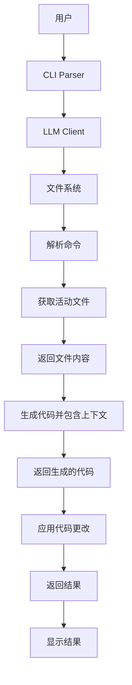
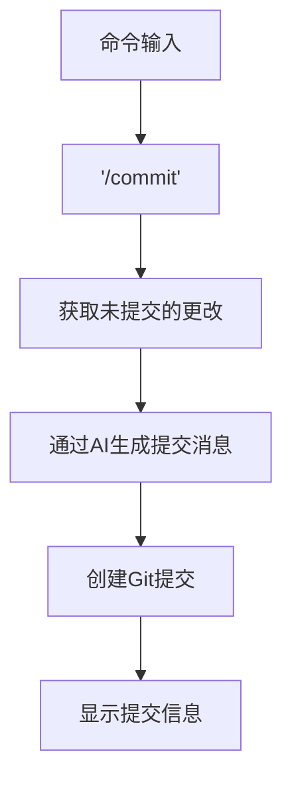
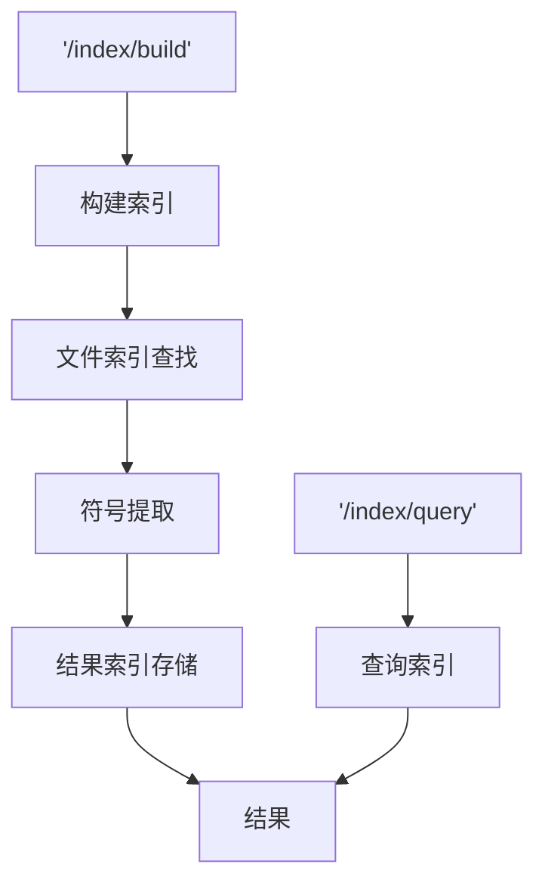
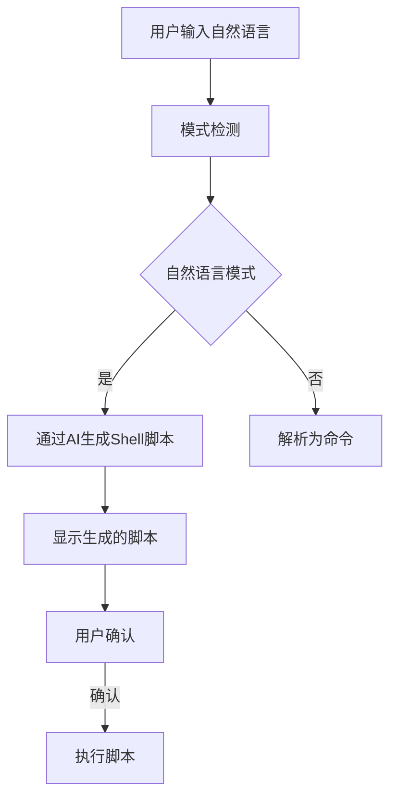
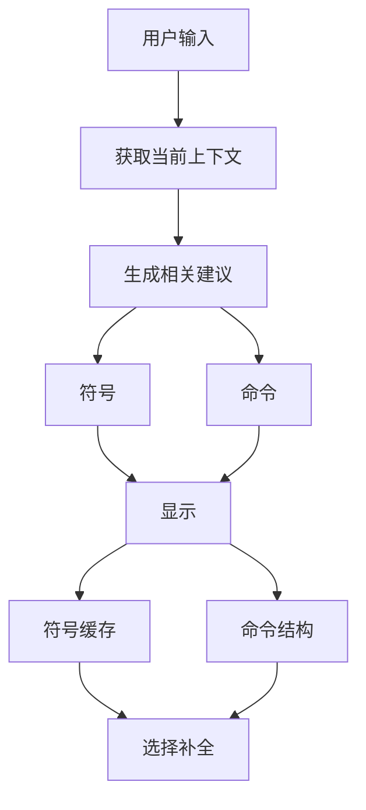
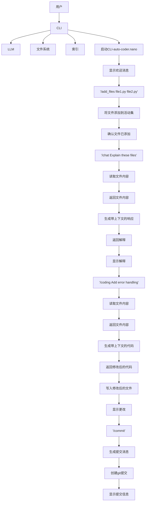

## 命令行界面（CLI）

AutoCoder Nano 的命令行界面（CLI）是用户访问系统功能的主要交互点。

本文档描述了 CLI 的结构, 命令和使用模式, 展示了用户如何利用它与语言模型进行交互, 以获得编码辅助, 聊天, 文件管理等服务。

关于 Web UI 的替代方案，请参阅 [Web UI]。具体命令的详细说明请参考 [命令参考]。

---

### 1.CLI 架构

AutoCoder Nano CLI 是一个交互式 Shell, 接受以斜杠（`/`）开头的命令, 其特性包括:

- 命令自动补全  
- 历史记录导航  
- 富文本输出(增强用户体验)

### 2.核心组件

#### 2.1.命令解析器 (Command Parser)

`CommandTextParser` 类负责解析用户输入并提取命令参数。它支持带有子命令的分层命令结构，以及编码命令的特殊语法。

解析器逐字符处理命令, 识别子命令, 参数和特殊语法元素。例如, 在处理 `/add_files` 时，它可以识别：

- 文件路径
- 组命令（`/group`, `/add`, `/drop` 等）
- 文件模式（带通配符）

#### 2.2.命令补全器 (Command Completer)

`CommandCompleter` 类为命令及其参数提供智能的 Tab 键补全功能。它与 prompt_toolkit 库集成, 在用户输入时提供上下文感知的建议。

补全器根据当前命令上下文提供不同类型的建议：

- 对于 `/add_files`, 它会建议文件名和目录名
- 对于 `/remove_files`, 它会建议当前活动的文件
- 对于 `/coding` 和 `/chat`，它会建议特殊语法，如 `@file` 和 `@@symbol`
- 对于 `/conf`，它会建议配置键和值

#### 2.3.内存管理 (Memory Config)

系统维护一个内存状态，以便在命令执行之间持久保存信息。这包括：

- 当前活动文件集
- 当前配置设置
- 对话历史记录
- 文件组

内存状态在启动时加载, 并在修改后保存, 确保会话之间的持久性。文件组允许用户组织相关文件, 并快速在不同上下文之间切换。

### 3.命令类别

#### 3.1.文件管理命令

文件管理命令允许用户控制哪些文件包含在用于 AI 交互的活动上下文中。

| 命令                   | 描述          | 示例                               | 参数说明                                                       |
|----------------------|-------------|----------------------------------|------------------------------------------------------------|
| `/add_files`         | 添加文件到活动上下文  | `/add_files file1.py file2.py`   | 可添加多个文件，支持文件路径、文件组相关操作（如`/add_files /group /add mygroup` ） |
| `/add_files /group`  | 列出或管理文件组    | `/add_files /group /add mygroup` | 可进行创建组（`/add`）等文件组操作                                       |
| `/remove_files`      | 从活动上下文中移除文件 | `/remove_files file1.py`         | 可移除指定文件，`/remove_files /all`用于清除所有活动文件                     |
| `/remove_files /all` | 清除所有活动文件    | `/remove_files /all`             | 无额外参数                                                      |
| `/list_files`        | 显示当前活动文件    | `/list_files`                    | 无额外参数                                                      |

文件组提供了一种强大的方式来管理相关文件集:

#### 3.2.配置命令

配置命令允许用户查看和修改系统设置。

| 命令                   | 描述        | 示例                                                                                          |
|----------------------|-----------|---------------------------------------------------------------------------------------------|
| `/conf`              | 显示当前配置    | `/conf`                                                                                     |
| `/conf key:value`    | 设置配置参数    | `/conf skip_build_index:true`                                                               |
| `/models`            | 列出可用模型    | `/models /list`                                                                             |
| `/models /add_model` | 添加新模型     | `/models /add_model name=model1 base_url=https://api.example.com api_key=sk-123 model=gpt4` |
| `/mode`              | 在不同模式之间切换 | `/mode auto_detect`                                                                         |

配置系统维护以下设置：

- 模型选择（聊天和代码模型）
- 项目类型
- 索引行为
- 代码合并策略

#### 3.3.编码和聊天命令

这些命令便于与AI模型进行交互，以生成代码和进行文本对话。

| 命令               | 描述           | 示例                    |
|------------------|--------------|-----------------------|
| `/coding`        | 根据指令生成或修改代码  | 为process_data函数添加错误处理 |
| `/coding /apply` | 将聊天历史应用于代码生成 | 修复我们讨论过的错误            |
| `/chat`          | 与模型进行文本对话    | 解释这个代码库的工作原理          |
| `/chat /history` | 显示对话历史记录     | `/chat /history`      |
| `/chat /new`     | 开始新对话        | 告诉我关于这个项目的信息          |

`/coding`和`/chat`命令都支持特殊语法：

- @filename：引用特定文件
- @@symbol：引用特定符号（函数、类等）

#### 3.4.版本控制命令

版本控制命令与Git集成，用于管理代码更改。

| 命令        | 描述            | 示例        |
|-----------|---------------|-----------|
| `/commit` | 使用AI生成的消息提交更改 | `/commit` |
| `/revert` | 撤销上一次AI生成的更改  | `/revert` |

提交过程会使用AI模型自动生成描述性的提交消息：

#### 3.5.索引管理命令

索引命令有助于管理用于检索增强生成的代码索引。

| 命令             | 描述        | 示例                      |
|----------------|-----------|-------------------------|
| `/index/build` | 构建或重建代码索引 | `/index/build`          |
| `/index/query` | 根据关键词查询索引 | `/index/query 查找文件上传功能` |

索引系统分析代码文件，提取符号（函数、类、变量）和语义信息，使AI更容易理解和引用代码元素。

### 4.高级功能

#### 4.1.自然语言模式

CLI支持自然语言模式，允许用户用普通英语输入命令，而无需使用特定的命令语法。可以通过/mode auto_detect命令或按Ctrl+K切换此模式。

在自然语言模式下，系统：

1. 接受用户的自然语言输入
2. 生成执行请求操作的Shell脚本
3. 显示脚本供用户确认
4. 如果用户确认，则执行脚本

自然语言命令示例：

- “查找所有包含‘error’一词的Python文件”
- “将assets文件夹中的所有图像宽度调整为200px”
- “创建当前项目的备份”

#### 4.2.命令补全

命令补全系统在用户输入时提供上下文感知的建议。这包括：

- 命令和子命令补全
- 文件名和目录名补全
- 符号名补全（函数、类）
- 配置参数补全
- 模型名补全

补全系统对于浏览大型代码库和发现可用命令特别有帮助。

### 5.CLI 会话流程

典型的CLI会话涉及与系统的一系列交互：

### 6.总结
AutoCoder Nano的命令行界面提供了一套全面的工具，用于与AI模型交互，辅助编码任务。通过具有智能补全功能的结构化命令系统，用户可以在一个界面中高效地管理文件、生成和修改代码、进行对话以及管理版本控制。

CLI的主要优势包括：
- 具有智能补全功能的结构化命令系统
- 用于管理活动文件和配置的持久内存
- 与Git集成进行版本控制
- 自然语言模式，可简单表达复杂任务
- 富文本输出，提高可读性