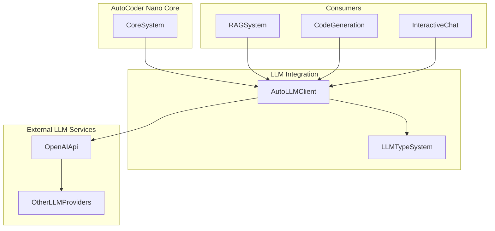
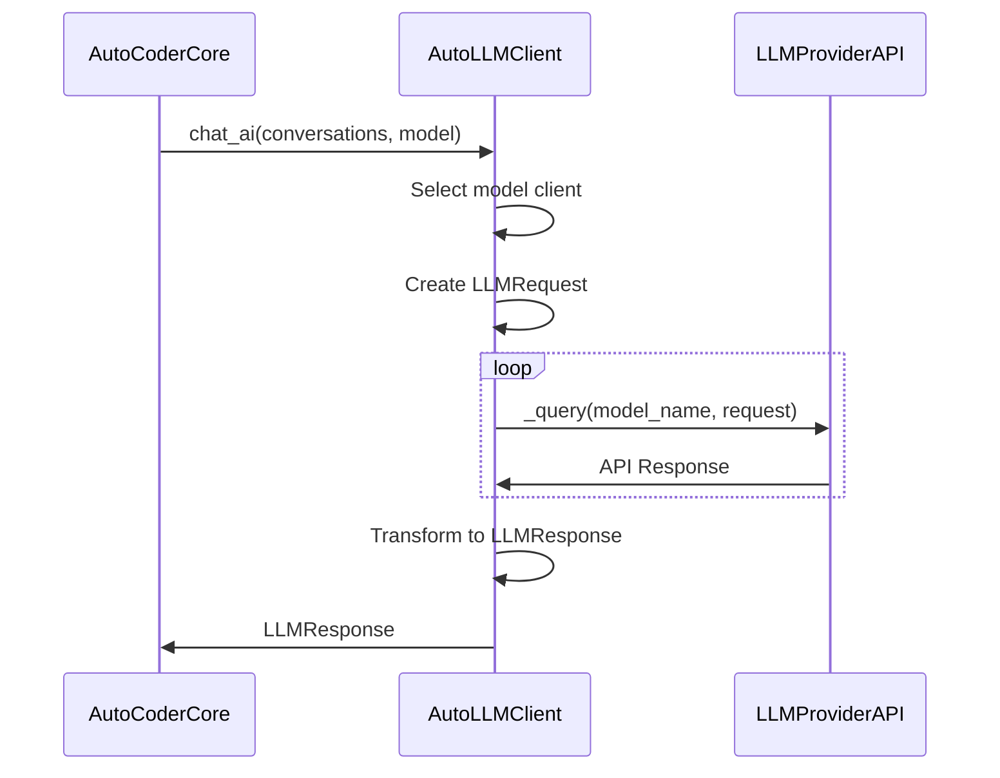
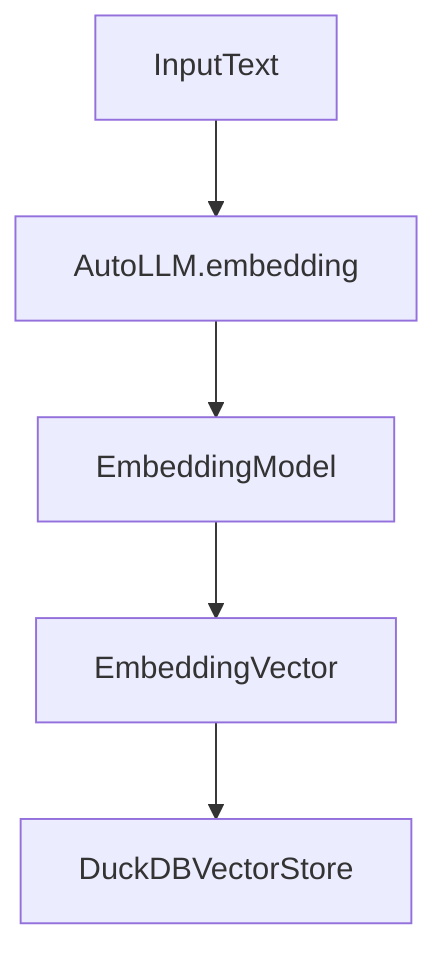
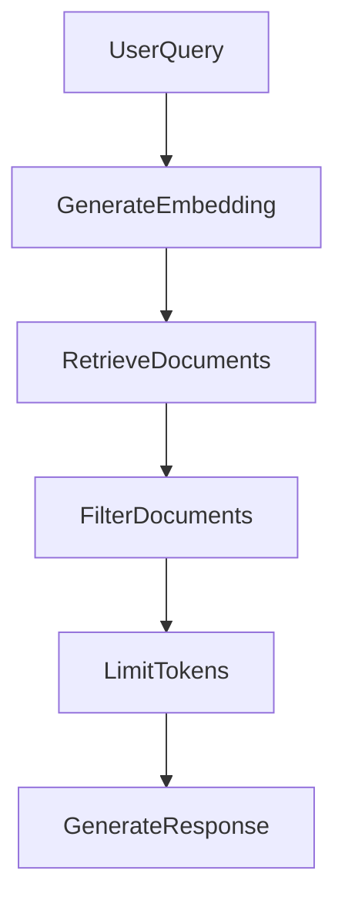
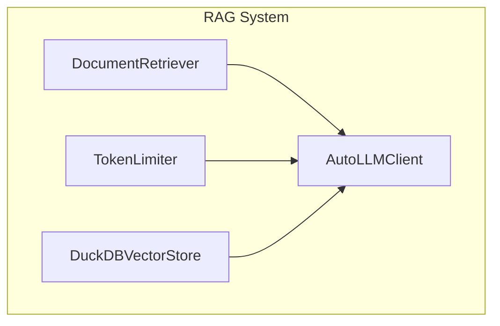

## 大语言模型集成

### 1.目的和范围

本文档介绍了 AutoCoder Nano 如何与大语言模型 (LLMs) 集成，它在应用程序和各种大语言模型服务之间起到了桥梁的作用。

大语言模型集成组件实现了包括代码生成, 上下文感知响应, 以及为检索增强生成（RAG）系统提供向量嵌入等关键功能。

有关RAG系统的详细信息，请参阅RAG系统。

### 2.架构概述

AutoCoder Nano中的大语言模型集成层遵循客户端 - 适配器模式，该模式抽象了与不同大语言模型提供商和模型交互的复杂性。



### 3.关键组件

#### 3.1.AutoLLM客户端

AutoLLM类是与语言模型交互的主要接口。它为不同的大语言模型提供商和模型提供了统一的API。

```
AutoLLM
+default_model_name: str
+sub_clients: dict
+setup_sub_client(client_name, api_key, base_url, model_name)
+remove_sub_client(client_name)
+get_sub_client(client_name)
+setup_default_model_name(model_name)
+stream_chat_ai(conversations, model)
+chat_ai(conversations, model) - _query(model_name, request, stream)
+embedding(text, model)
```

该客户端负责：

- 建立与多个大语言模型提供商的连接。
- 为不同目的管理不同的模型。
- 处理文本补全请求。
- 流式传输响应。
- 为向量搜索生成嵌入。

#### 3.2.大语言模型类型系统

类型系统定义了大语言模型操作的请求和响应结构，无论底层的大语言模型提供商是谁，都提供了一致的接口。

**请求**

```
LLMRequest
+model: str 
+messages: List[Dict[str, str]] 
+stream: bool
+max_tokens: Optional[int] 
+temperature: Optional[float] 
+top_p: Optional[int] 
+stop: Optional[float] 
+n: Optional[List[str]] 
+presence_penalty: Optional[float] 
+frequency_penalty: Optional[float]
```

**返回**

```
LLMResponse
+output: Union[str, List[float]] 
+input: Union[str, Dict[str, Any]] 
+metadata: Dict[str, Any]
```

- LLMRequest模型定义了大语言模型API调用的参数，而LLMResponse为响应提供了标准化的结构。

### 4.配置和模型管理

AutoCoder Nano支持为不同目的使用多个模型，通过AutoCoderArgs类进行配置。

系统允许为不同任务指定不同的模型：

| 模型参数         | 用途           |
|--------------|--------------|
| model        | 通用任务的默认模型    |
| chat_model   | AI聊天交互模型     |
| code_model   | 代码生成模型       |
| index_model  | 代码索引模型       |
| commit_model | Git提交消息生成模型  |
| emb_model    | 用于RAG的嵌入生成模型 |
| recall_model | 用于RAG的文档检索模型 |
| chunk_model  | 片段重新排序模型     |
| qa_model     | 用于RAG的问答模型   |
| vl_model     | 视觉 - 语言多模态模型 |


### 5.请求-响应 流程

以下图表展示了典型的大语言模型请求在系统中的流程：



### 6.流式传输支持

对于交互式应用程序，AutoCoder Nano支持流式传输大语言模型的响应，允许实时反馈：

### 7.嵌入生成

大语言模型集成的一个关键特性是能够为文本生成嵌入，这为RAG系统的向量搜索功能提供了支持：



嵌入函数接受一系列文本输入，并返回一个捕获语义含义的向量表示，从而实现基于相似度的检索。

### 8.与RAG系统集成

大语言模型集成与检索增强生成（RAG）系统紧密耦合，实现了上下文感知响应：





大语言模型客户端在RAG过程的多个阶段被使用：

1. 为文档存储生成嵌入。
2. 基于查询相似度检索相关文档。
3. 处理和筛选检索到的文档。
4. 利用增强的上下文生成最终响应。

### 9.令牌管理

令牌限制器组件管理大语言模型请求的上下文窗口大小，确保模型容量的最佳利用：

令牌限制过程包括：
1. 对相关文档重新排序以保持逻辑顺序。
2. 用尽可能多的完整文档填充上下文窗口。
3. 如果需要，仅提取剩余文档中最相关的部分。
4. 确保最终的文档集符合模型上下文窗口的限制。

### 10.API参考

**AutoLLM方法**

  | 方法                                                           | 描述                |
  |--------------------------------------------------------------|-------------------|
  | setup_sub_client(client_name, api_key, base_url, model_name) | 配置一个新的大语言模型提供商客户端 |
  | remove_sub_client(client_name)                               | 删除已配置的客户端         |
  | get_sub_client(client_name)                                  | 获取已配置的客户端         |
  | setup_default_model_name(model_name)                         | 设置要使用的默认模型        |
  | stream_chat_ai(conversations, model)                         | 从大语言模型流式传输响应      |
  | chat_ai(conversations, model)                                | 从大语言模型获取完整响应      |
  | embedding(text, model)                                       | 为输入文本生成嵌入         |


**LLMRequest参数**

| 参数                | 类型                   | 描述               |
|-------------------|----------------------|------------------|
| model             | str                  | 要使用的模型标识符        |
| messages          | List[Dict[str, str]] | 对话历史记录           |
| stream            | bool                 | 是否流式传输响应         |
| max_tokens        | Optional[int]        | 要生成的最大令牌数        |
| temperature       | Optional[float]      | 控制随机性（0.0 - 2.0） |
| top_p             | Optional[float]      | 通过核采样控制多样性       |
| n                 | Optional[int]        | 要生成的补全数量         |
| stop              | Optional[List[str]]  | API将停止生成的序列      |
| presence_penalty  | Optional[float]      | 惩罚重复出现的令牌        |
| frequency_penalty | Optional[float]      | 惩罚频繁出现的令牌        |


AutoCoder Nano的大语言模型集成组件为各种语言模型提供了灵活而强大的接口, 实现了系统的核心功能。

通过抽象不同大语言模型提供商的复杂性, 它使系统的其他部分能够专注于通过代码生成, 辅助和理解为用户提供价值。

