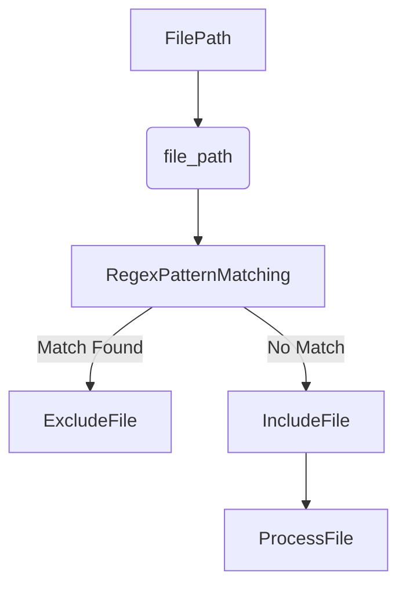
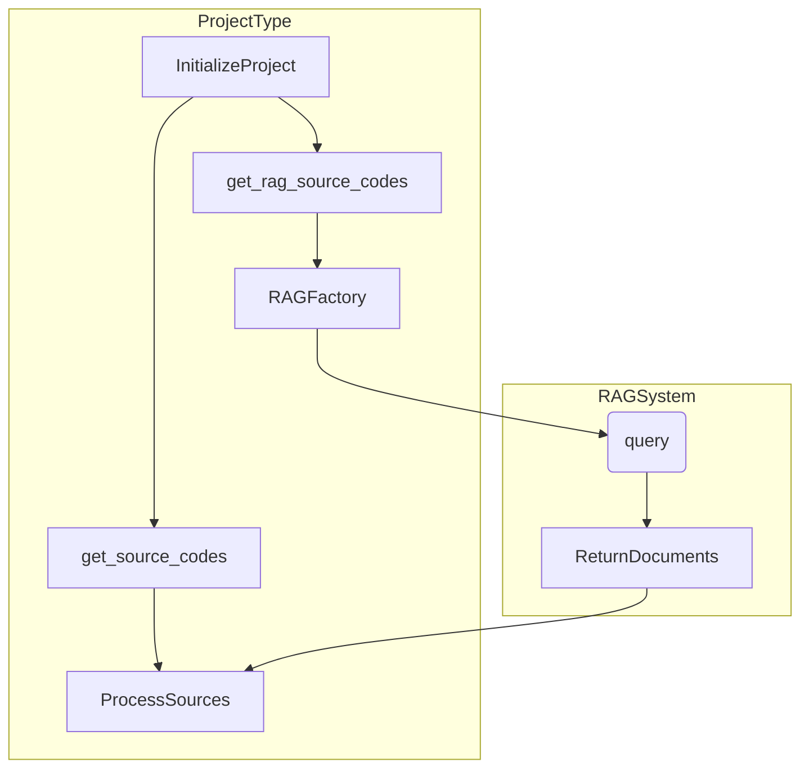

## 项目类型

本文档介绍了 AutoCoder Nano 中的项目类型系统，该系统能让工具正确分析和处理不同类型的代码库。

项目类型决定了 AutoCoder Nano 如何遍历目录, 识别相关文件, 排除不需要的内容, 以及收集源代码进行分析。

有关用于代码检索的RAG系统的信息，请参阅RAG系统。有关代码生成和编辑的信息，请参阅代码生成与编辑。

### 1.项目类型概述

AutoCoder Nano支持三种类型的项目：

1. **PyProject** - 专为Python代码库设计
2. **TSProject** - 专为TypeScript/JavaScript代码库设计
3. **SuffixProject** - 可根据文件扩展名自定义任何文件类型

每种项目类型都实现了类似的功能，但针对特定的文件类型和目录结构进行了专门优化。

### 2.通用功能

所有项目类型在处理代码库时都具备通用功能：

1. **文件遍历** - 遍历目录结构
2. **文件过滤** - 确定包含或排除哪些文件
3. **源代码提取** - 读取文件并将其转换为源代码对象
4. **RAG集成** - 从RAG系统检索相关上下文
5. **输出生成** - 将收集到的源代码写入目标文件

### 3.项目类型详情

#### 3.1.PyProject Type

PyProject 专为 Python 代码库设计, 专注于 `.py` 文件，同时排除常见的非 Python 目录, 如虚拟环境。

**关键特性**：

- 仅处理扩展名为.py的文件
- 排除常见的特定于Python的目录（例如__pycache__、.venv）
- 为Python代码分析提供合适的上下文

**PyProject中的文件过滤逻辑**

```python
def is_python_file(file_path):
    return file_path.endswith(".py")
```

#### 3.2.TSProject Type

TSProject 专为 TypeScript 和 JavaScript 代码库设计, 包括React应用程序。

**关键特性**：

- 处理.ts、.tsx、.js和.jsx文件
- 忽略常见的前端构建产物和依赖项
- 排除媒体文件、样式表和配置文件

**TSProject过滤逻辑**

```python
def is_likely_useful_file(file_path):
    # 排除node_modules、dist等目录
    # 仅包含TypeScript/JavaScript文件
    include_extensions = [".ts", ".tsx", ".js", ".jsx"]
    return any(file_path.endswith(ext) for ext in include_extensions)
```

#### 3.3.SuffixProject Type

SuffixProject是一种灵活的项目类型，可以配置为处理任何文件扩展名，使其适用于各种编程语言和项目结构。

**关键特性**：

- 可配置为包含具有特定后缀的文件
- 接受以逗号分隔的文件扩展名列表
- 允许在不修改代码库的情况下进行自定义项目分析


**SuffixProject配置和过滤**

```
def __init__(self, llm: AutoLLM, args: AutoCoderArgs, exclude_files=""):
    #...
    self.suffixs = [
        suffix.strip() if suffix.startswith(".") else f".{suffix.strip()}"
        for suffix in self.project_type.split(",") if suffix.strip()
    ]
    #...
def is_suffix_file(self, file_path):
    return any([file_path.endswith(suffix) for suffix in self.suffixs])
```

### 4.排除文件模式



### 5.与RAG系统集成

项目类型可以与RAG（检索增强生成）系统集成，用代码库中的相关文档丰富上下文。



### 6.项目类型选择和使用

下表总结了何时使用每种项目类型：

| 项目类型          | 最适合的场景                   | 文件扩展名             | 配置                        |
|---------------|--------------------------|-------------------|---------------------------|
| PyProject     | Python代码库                | .py               | 默认                        |
| TSProject     | TypeScript/JavaScript代码库 | .ts、.tsx、.js、.jsx | 默认                        |
| SuffixProject | 自定义文件类型                  | 任何指定的扩展名          | 需要project_type参数，以逗号分隔扩展名 |


### 7.项目类型工作流程

所有项目类型的整体工作流程都遵循相同的模式：

1. 初始化项目
2. 配置排除项
3. 处理REST URL
4. 遍历目录
5. 按规则过滤文件
6. 读取文件
7. 转换为源代码
8. 获取RAG上下文
9. 写入目标文件

### 8.实现注意事项

在AutoCoder Nano中使用项目类型时，请注意以下几点：

1. **初始化**：所有项目类型都需要一个AutoLLM实例和AutoCoderArgs参数
2. **文件排除**：使用正则表达式模式对排除哪些文件进行精细控制
3. **目录结构**：默认排除项有助于避免处理非源目录
4. **RAG集成**：项目类型可以利用RAG系统来增强上下文

有关内置选项未涵盖的自定义项目类型，请参阅自定义项目类型，以获取创建专门项目处理的指导。
