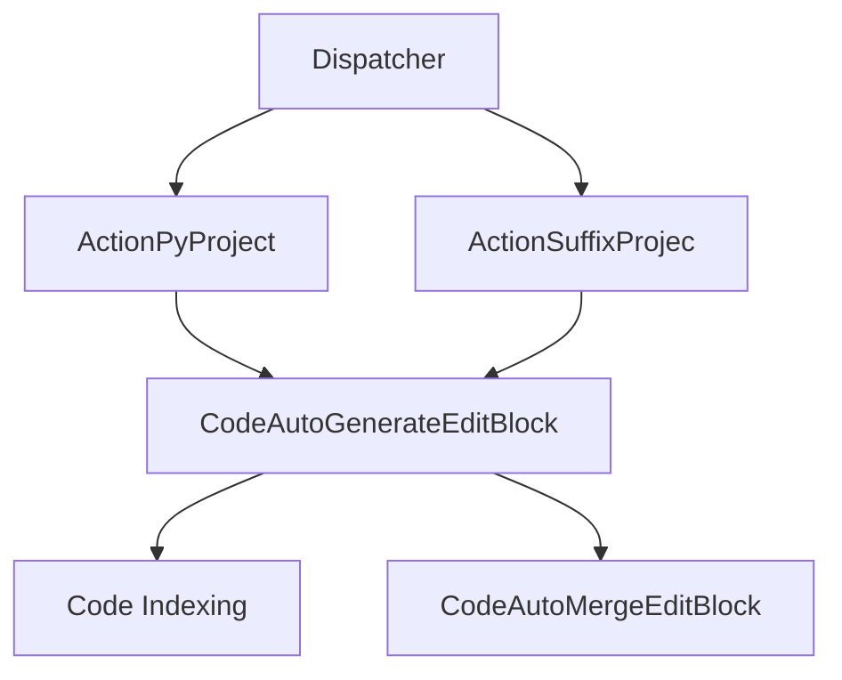
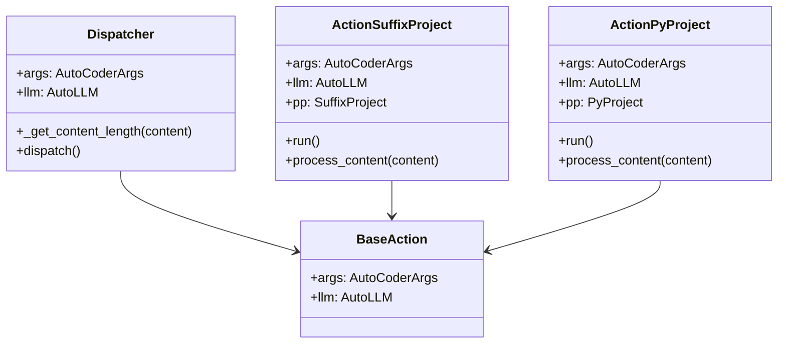

## 代码生成与编辑

本文档详细介绍了AutoCoder Nano的代码生成和编辑功能。

该系统能够根据用户查询自动生成代码, 支持多种项目类型和灵活的集成策略。有关支持这些功能的代码索引信息, 请参阅“代码索引”。

### 1.架构概述

AutoCoder Nano实现了一个模块化的代码生成和编辑系统, 它通过调度器模式处理用户请求, 根据项目类型选择合适的操作。

#### 1.1.调度器系统

调度器根据项目类型将代码生成请求路由到相应的操作处理程序。它使用简单的迭代模式来查找第一个兼容的操作。

### 2.代码生成过程

代码生成过程遵循以下关键步骤：

1. **请求调度**：用户请求被路由到相应的操作处理程序。
2. **源收集**：操作处理程序从项目中收集源代码。
3. **索引构建**：如果启用，会对相关文件进行索引以提供上下文。
4. **代码生成**：大语言模型（LLM）根据源内容和用户查询生成代码。
5. **代码合并**：如果启用自动合并，生成的代码将与现有代码合并。
6. **文件写入**：最终生成的代码被写入目标文件。

#### 2.1.操作处理

系统通过专门的操作处理程序支持不同的项目类型：

| 操作类                 | 项目类型   | 描述                       |
|---------------------|--------|--------------------------|
| ActionPyProject     | Python | 使用PyProject处理器处理Python项目 |
| ActionSuffixProject | 多种     | 根据文件后缀处理项目               |

每个操作处理程序遵循类似的工作流程：

1. 初始化合适的项目处理程序。
2. 运行项目处理程序以收集源代码。
3. 可选地构建索引并筛选文件。
4. 处理内容以进行代码生成。

#### 2.2.代码生成策略

AutoCoder Nano支持不同的代码生成和合并策略：

- **生成**：最小化更改, 优化, 代码重构, 严格验证, 代码审查, 自动测试, 大规模修改, 功能扩展, 全面重构。
- **合并**：diff、strict_diff、editblock、CodeAutoGenerateEditBlock、CodeAutoMergeEditBlock。

目前，系统主要实现了“editblock”策略，该策略旨在进行全面的代码修改(其他策略待实现):

- **EditBlock生成**：创建可以插入、修改或替换的代码块。
- **EditBlock合并**：智能地将生成的代码块与现有代码库合并。

#### 2.3.单次和多轮生成

系统支持单次和多轮代码生成：

- **单次生成**：在单个LLM请求中生成代码。
- **多轮生成**：使用多次迭代来优化生成的代码。

可以通过AutoCoderArgs中的 `enable_multi_round_generate` 参数控制此配置。

#### 2.4.代码生成实现

代码生成过程通过 `CodeAutoGenerateEditBlock` 类实现，该类：

1. 以用户查询和源内容作为输入。
2. 使用LLM生成合适的代码更改。
3. 返回包含生成代码的结构化结果。

然后，通过 `CodeAutoMergeEditBlock` 类进行代码合并：

1. 以生成结果作为输入。
2. 智能地将生成的代码与现有代码合并。
3. 解决冲突并确保连贯集成。

#### 2.5.与项目系统的集成

代码生成系统与AutoCoder Nano的项目处理系统紧密集成：操作处理程序初始化并运行合适的项目处理程序，这些项目处理程序负责收集源文件并为代码生成生成必要的上下文。

#### 2.6.工作流程示例

典型的代码生成工作流程如下：

1. 用户通过查询发起代码生成。
2. 调度器将请求路由到相应的操作。
3. 操作运行项目处理程序以收集源代码。
4. 项目处理程序处理相关文件。
5. 代码生成器使用LLM根据查询和源生成代码。
6. 代码合并器将生成的代码与现有代码集成。
7. 最终代码被写入目标文件。

这个过程使AutoCoder Nano能够在不同的项目类型和文件格式中生成符合上下文的代码修改。

#### 2.7.令牌管理

代码生成过程的一个重要方面是令牌管理。

在将内容发送到LLM之前，系统会检查内容长度是否超过模型的最大输入长度：这样可以在处理大型代码库时避免错误，并确保LLM接收到的输入在其上下文窗口内。
