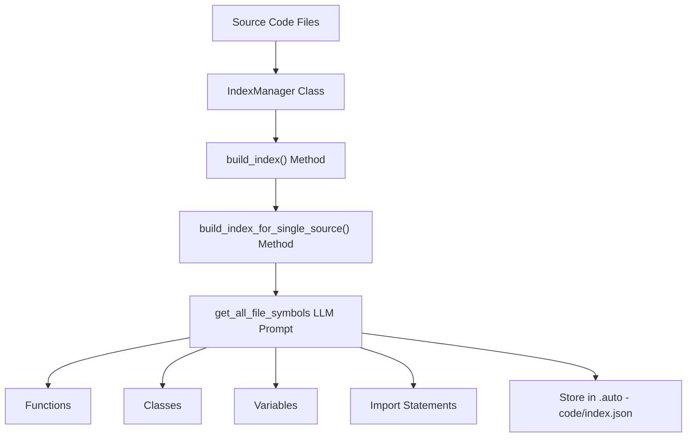

## 代码索引

代码索引是AutoCoder Nano的核心子系统, 用于从源代码文件中提取, 组织符号信息，并提供高效访问。

它使系统能够理解代码库结构，识别与代码生成和编辑任务相关的文件。  

有关索引代码在检索操作中的使用，请参阅《文档检索》。有关代码索引与Git的集成，请参阅《Git集成》。

### 1.核心功能

代码索引系统执行以下基本功能：  

1. 从源代码中提取符号信息（函数, 类, 变量, 导入语句）  
2. 构建并维护存储在 `.auto-coder/index.json` 中的可搜索索引  
3. 提供多级过滤功能，基于用户查询选择相关文件  
4. 使用基于大语言模型(LLM)的评分验证文件相关性  
5. 为检索增强生成（RAG）系统提供上下文代码信息  

#### 1.1.代码索引流程



### 2.IndexManager类

代码索引系统的核心组件是IndexManager类, 它维护代码索引并提供构建, 更新和查询索引的方法。  

**关键属性**：  

- index_dir：索引文件存储目录（.auto-coder）  
- index_file：索引JSON文件路径（.auto-coder/index.json）  
- max_input_length：LLM输入的最大令牌长度  
- anti_quota_limit：LLM请求之间的休眠时间，避免速率限制  

**关键方法**：  

- `build_index()`：构建或更新代码索引  
- `build_index_for_single_source()`：处理单个源文件  
- `get_target_files_by_query()`：基于查询查找相关文件  
- `get_related_files()`：查找与一组目标文件相关的文件  
- `verify_file_relevance()`：验证文件是否与查询相关  

#### 2.1.符号提取

IndexManager使用LLM提示从代码文件中提取符号。get_all_file_symbols提示提取内容包括：  

1. 函数及其参数  
2. 类及其方法  
3. 变量及其类型  
4. 导入语句  

这种提取方式利用LLM的自然语言处理能力，而非传统解析，可更灵活处理不同编程语言。  

#### 2.2.大文件处理

对于超过LLM令牌限制的文件，系统将其拆分为可管理的块：  

```python
def split_text_into_chunks(self, text):
    lines = text.split("\n")
    """ Split text into chunks that fit within token limits """
    chunks = []
    current_chunk = []
    current_length = 0
    # Process line by line, adding to current chunk if it fits
    # or starting a new chunk if needed
```  

系统分别处理每个块并合并结果。  

### 3.多级文件过滤流程

文件过滤和选择流程通过`build_index_and_filter_files()`实现，遵循多级方法：  

#### 3.1.一级过滤（基于查询）

一级过滤使用`get_target_files_by_query()`方法查找与用户查询相关的文件，步骤包括：  

1. 读取代码索引  
2. 可能基于index_filter_level应用过滤  
3. 分块处理索引元数据以适应令牌限制  
4. 使用LLM提示识别相关文件  
5. 基于index_filter_file_num限制文件数量  

LLM提示专门查找：  

- 查询中的@符号以识别文件路径  
- @@符号以识别函数、类或变量  
- 基于文件用途和符号的相关文件  

#### 3.2.二级过滤（相关文件）

二级过滤查找与一级过滤结果相关的文件，`get_related_files()`方法：  

1. 接收一级过滤的文件路径列表  
2. 使用LLM提示识别引用或被引用的文件  
3. 返回相关文件列表及包含原因  

这有助于识别查询未直接匹配的依赖项和相关组件。  

#### 3.3.文件相关性验证

最后阶段使用`verify_file_relevance()`方法对文件相关性评分：  

1. 将文件内容和查询发送至LLM  
2. LLM按0-10分评估相关性  
3. 得分高于verify_file_relevance_score阈值的文件被纳入  
4. 结果以表格形式显示分数和原因  

此验证确保仅将真正相关的文件纳入上下文。  

### 4.系统工作流程

以下说明代码索引系统的完整工作流程：  

- 用户通过命令行界面或文件系统运行带查询的命令 → 初始化IndexManager → 检查现有索引：
  - 若存在，返回现有索引数据  
  - 若不存在，创建.auto-coder目录→识别需要索引的文件→对每个文件：  
    - 必要时拆分大文件→提取符号→存储文件元数据和符号→写入index.json
- 使用索引处理查询 → 查找目标文件(get_target_files_by_query) → 查找相关文件(get_related_files) → 验证文件相关性 → 过滤和限制结果 → 返回最终上下文并显示结果  

### 5.与其他组件的集成

代码索引系统与AutoCoder Nano的其他组件集成：  
AutoCoder Nano Core IndexManager  
Document Retriever Hybrid Index Cache  

### 6.索引结构

索引存储为.auto-coder/index.json中的JSON文件，结构如下：  

```json
{
    "path/to/file.py": {
        "symbols": "Functions: func1, func2\nClasses: Class1, Class2\nVariables: var1, var2\nImport statements: import os^^import time",
        "last_modified": 1623456789.123,
        "md5": "a1b2c3d4e5f6g7h8i9j0"
    }
}
```  

每个文件条目包含：  

- module_name：文件路径  
- symbols：提取符号的字符串表示  
- last_modified：最后修改时间戳  
- md5：文件内容的MD5哈希，用于变更检测  

### 7.配置选项

代码索引系统可通过AutoCoderArgs类配置，参数如下：  

| 参数                          | 目的              | 默认值   |
|-----------------------------|-----------------|-------|
| skip_build_index            | 若设为True则跳过索引构建  | False |
| skip_filter_index           | 若设为True则跳过过滤    | False |
| index_filter_level          | 过滤级别（0-2）       | 1     |
| index_filter_file_num       | 包含的最大文件数        | 10    |
| verify_file_relevance_score | 文件纳入的最低分数（0-10） | 5     |
| anti_quota_limit            | LLM调用之间的休眠时间    | 0.5   |
| filter_batch_size           | 过滤操作的批处理大小      | 5     |

### 8.总结

代码索引系统通过提取符号信息、构建可搜索索引和识别相关文件，使AutoCoder Nano能够理解和导航代码库。通过多级过滤和基于LLM的相关性验证，系统为代码生成和编辑任务提供精确的上下文相关支持。  

如需了解更多关于w4n9H/autocoder-nano的信息，请联系Devin。