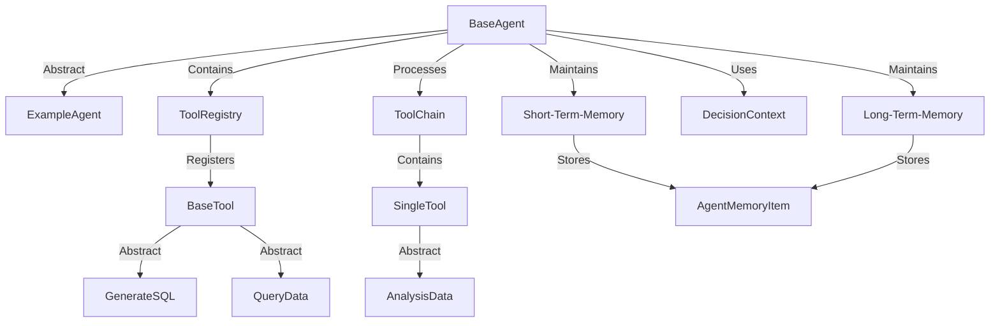

## 高级功能(开发者的功能)

本文档介绍了AutoCoder Nano的高级功能，这些功能超越了基本的代码生成和编辑特性。

这些高级功能支持更复杂的工作流程、自主任务执行和特定项目处理。

有关基本代码生成功能的信息，请参阅“代码生成与编辑”。有关基于Web的界面的信息，请参阅“Web用户界面”。

### 1.智能体系统

智能体系统为复杂的多步骤任务执行提供了灵活的架构。

它使AutoCoder Nano能够将用户请求分解为一系列工具执行步骤, 记录先前操作, 并根据上下文做出决策。

#### 1.1.智能体架构




#### 1.2.数据模型

智能体系统使用几个关键数据模型来组织和处理信息：

| 模型              | 描述              | 关键字段                                           |
|-----------------|-----------------|------------------------------------------------|
| AgentMemoryItem | 记录智能体执行过程中的一个步骤 | step_id、action、parameters、result、output_fields |
| DecisionContext | 为决策提供上下文        | user_input、history、memory、context_vars         |
| SingleTool      | 表示单个工具操作        | action、parameters、reasoning、output_fields      |
| ToolChain       | 包含要执行的一系列工具     | tools                                          |


#### 1.3.执行流程

1. 用户发起请求`process_request(user_input)`。
2. 将请求添加到历史记录中。
3. “BaseAgent”的`decide_next_action`方法返回一个`ToolChain`（工具链）。
4. 对于工具链中的每个工具：
   - 增加步骤计数器。
   - 执行工具`execute_tool(tool_name, parameters, context_vars)`。
   - 返回结果。
   - 将输出存储到上下文中，使用结果更新`context_vars`。
   - 创建`AgentMemoryItem`并添加到短期记忆中。
   - 如果需要持久化，则添加到长期记忆中。
5. 返回最终响应。

#### 1.4.创建自定义智能体

要创建自定义智能体，需要：

1. 继承自`BaseAgent`。
2. 实现`decide_next_action`方法。
3. 为智能体注册要使用的工具。

示例代码：

```
class MyCustomAgent(BaseAgent):
    def __init__(self, llm):
        super().__init__()
        self.llm = llm # 用于决策的大语言模型客户端

    def decide_next_action(self, context: DecisionContext) -> ToolChain:
        # 在此处实现决策逻辑
        # 返回一个ToolChain对象
        pass
```

#### 1.5.创建自定义工具

工具是智能体能力的基础组成部分。可以通过继承`BaseTool`来创建自定义工具：

```
class MyCustomTool(BaseTool):
    def __init__(self):
        super().__init__(
            name="tool_name",
            description="描述工具的功能",
            input_parameters="输入参数说明",
            output_parameters="输出格式说明"
        )

    def execute(self, **kwargs) -> Dict:
        # 在此处实现工具逻辑
        # 返回包含结果的字典
        pass
```

#### 1.6.工具链执行

智能体系统通过一系列工具执行来处理用户请求：

1. 用户提交请求。
2. 智能体使用用户输入、历史记录和记忆创建决策上下文。
3. 智能体决定要执行的工具序列（工具链）。
4. 按顺序执行工具链中的每个工具。
5. 每个步骤的结果存储在上下文变量中。
6. 将最终结果返回给用户。

#### 1.7.与大语言模型集成进行决策

智能体系统可以利用大语言模型来进行工具链决策：

1. 用户创建`DecisionContext`。
2. 将`DecisionContext`传递给`decide_next_action()`方法。
3. 构建大语言模型提示。
4. 将提示发送给`AutoLLM`。
5. `AutoLLM`返回`ToolChain`。
6. `BaseAgent`执行`ToolChain`并返回最终结果。

`ExampleAgent`的实现展示了如何与大语言模型集成以确定合适的工具链：

1. 使用上下文和可用工具格式化提示。
2. 将提示发送给大语言模型。
3. 将响应解析为`ToolChain`对象。
4. 执行工具链。


### 2.项目创建

AutoCoder Nano具备从头开始创建新项目的功能。此功能是作为智能体系统的扩展来实现的。

#### 2.1.项目创建工作流程

项目创建功能的工作方式可能如下：

1. 用户指定想要创建的项目类型。
2. 系统激活用于项目创建的特定智能体。
3. 智能体使用一系列工具：
    - 创建项目目录结构。
    - 生成初始配置文件。
    - 添加常用文件（例如README、.gitignore）。
    - 设置依赖项。
    - 生成初始代码。

虽然在所提供的源文件中没有项目创建的具体实现细节，但该架构可能利用智能体系统将项目创建的复杂任务分解为可管理的步骤。

#### 2.2.与项目类型集成

项目创建功能可能与“项目类型”中描述的项目类型系统集成，使其能够创建不同类型的项目：

- Python项目
- TypeScript项目
- 由后缀模式定义的自定义项目类型

### 3.结论

AutoCoder Nano的高级功能扩展了其简单代码生成和编辑之外的能力。

智能体系统为复杂任务执行提供了灵活的架构，而项目创建功能则支持新项目的快速启动。这些功能构建在AutoCoder Nano的核心组件之上，并利用大语言模型提供智能辅助。